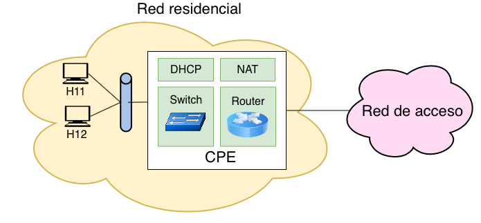
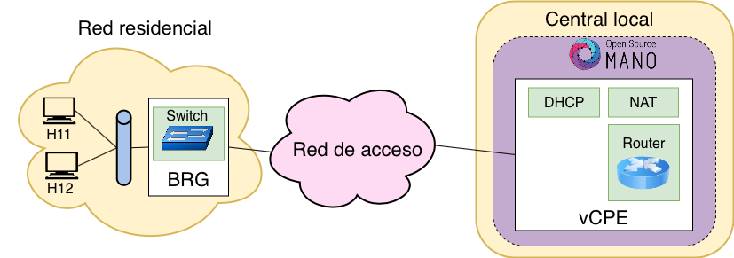
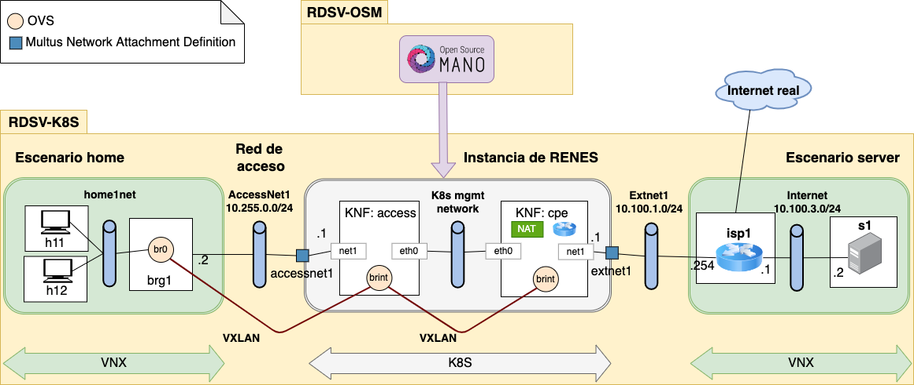

# RDSV/SDNV P4  - Plataforma de orquestación de servicios basados en NFV

## Resumen
En esta práctica, se va a utilizar la plataforma de código abierto Open Source Mano (OSM) para profundizar en la orquestación de funciones de red virtualizadas. El escenario que se va a utilizar está inspirado en la reconversión de las centrales locales a centros de datos que permiten, entre otras cosas, reemplazar servicios de red ofrecidos mediante hardware específico y propietario por servicios de red definidos por software sobre hardware de propósito general. Las funciones de red que se despliegan en estas centrales se gestionan mediante una plataforma de orquestación como OSM o XOS. 

El servicio de red objeto de estudio es el servicio residencial de acceso a Internet. La  Fig. 1 ilustra las funciones que tradicionalmente realiza el “router residencial” (Customer Premises Equipment – CPE) desplegado en casa del usuario, como switch Ethernet / punto de acceso WiFi, servidor DHCP, traducción de direcciones NAT y reenvío de datagramas IP. El objetivo de la práctica es estudiar como esas funciones pasarán a realizarse en la central local. 



*Fig. 1. CPE tradicional*

Como se observa en la Fig. 2, el router residencial se sustituye por un equipo que llamaremos “Bridged Residential Gateway (BRG)” que realiza la conmutación de nivel 2 del tráfico de los usuarios entre la red residencial y la central local. El resto de las funciones (DHCP, NAT y router para reenvío IP) se realizan en la central local aplicando técnicas de virtualización de funciones de red (NFV), creando un servicio de CPE virtual (vCPE) gestionado mediante la plataforma de orquestación. 



*Fig. 2. CPE virtualizado*

## Escenario

La Fig. 3 muestra una visión global del escenario que se va a emular, con dos sistemas finales h11 y h12 en casa del usuario, conectados al brg1 que, a través de la red de acceso AccessNet se conecta a su vez a la central local, donde el servicio de red residencial "RENES" (REsidential NEtwork Service) se va a ofrecer a través de dos VNF implementadas mediante Kubernetes (KNF):

- Una KNF:access, que se conecta a la red de acceso y permitiría clasificar el tráfico e implementar QoS en el acceso del usuario a la red
- Una KNF:vcpe, que integrará las funciones de servidor DHCP, NAT y reenvío de IP. 

El entorno utilizado para gestionar los servicios de red es OSM.


*Fig. 3. Visión global del escenario*

El escenario explicado se va a implementar para la práctica en dos máquinas Linux en VirtualBox, conectadas a la red `192.168.56.0/24` junto con el PC anfitrión (`192.168.56.1`): 

- **RDSV-K8S** (`192.168.56.11`). Permite emular las distintas redes y hosts del escenario, y el cluster de Kubernetes (K8s) de la central local. Tiene instaladas las herramientas:
   - el paquete _microk8s_ para proporcionar la funcionalidad de k8s
   - la herramienta _VNX_, que se usará para emular los equipos de la red residencial, el router isp1 y el servidor s1
   - _Open vSwitch (ovs)_, que permitirá emular la red de acceso AccessNet1, la red externa ExtNet1 que da salida al router isp1, y que además se utiliza tanto en la emulación del bgr1 como en las KNFs
- **RDSV-OSM** (`192.168.56.12`). Instalación del entorno _OSM_, al que se accede gráficamente con un navegador, o mediante terminal con el comando `osm`

Esas máquinas tendrán conectividad entre ellas y con el host a través de la red 192.168.56.0/24.

El detalle del escenario se puede ver en la Fig 4. 



*Fig. 4. Visión detallada del escenario*

Como se refleja en la figura, se utilizará la tecnología _VXLAN_ para enviar encapsuladas en datagramas UDP las tramas de nivel 2 que viajan entre brg1, KNF:access y KNF:cpe. Para permitir esta comunicación, tanto el brg1 como KNF:access tendrán interfaces en AccessNet1, configuradas con direcciones IP del prefijo 10.255.0.0/24. La asignación de direcciones IP a KNF:access y KNF:cpe en la red que las interconecta está gestionada por OSM y k8s, de manera que se asignan dinámicamente al instanciar las KNFs.

## Desarrollo de la práctica
1. Desde un PC del laboratorio, ejecute:

```
/lab/rdsv/rdsv-get-osm
```

Este comando:
- instala la ova que contiene las dos máquinas virtuales en VirtualBox,
- crea la red de interconexión entre ellas, si no está ya creada,
- crea el directorio `$HOME/shared` en la cuenta del usuario del laboratorio y la añade como directorio compartido en las dos máquinas virtuales, en `/home/upm/shared`

2. Descargue en el directorio compartido el repositorio de la práctica, de forma que esté accesible tanto en el PC anfitrión como en las máquinas _RDSV-OSM_ y _RDSV-K8S_. Para ello, abra una ventana de terminal y ejecute los siguientes comandos:

```
cd ~/shared
git clone https://github.com/educaredes/nfv-lab.git
cd nfv-lab
```

3. Arranque por línea de comando las máquinas:

```
vboxmanage startvm RDSV-OSM --type headless # arrancar sin interfaz gráfica
vboxmanage startvm RDSV-K8S
``` 

4. Acceda a _RDSV-K8S_ y compruebe que están creados los switches `AccessNet1` y `ExtNet1` tecleando en un terminal:

```
sudo ovs-vsctl show
```

Compruebe también mediante un ping la conectividad con _RDSV-OSM_ y con el PC anfitrión.

5. En _RDSV-K8S_ arranque el escenario vnx de las redes residenciales:

```
cd /home/upm/shared/nfv-lab
sudo vnx -f vnx/nfv3_home_lxc_ubuntu64.xml -t
```

El escenario contiene dos redes residenciales, nos centraremos inicialmente en la primera de ellas (sistemas finales h11 y h12). Compruebe en los terminales de los hosts h11 y h12 que no tienen asignada dirección IP en la interfaz `eth1` mediante:

```
ifconfig eth1
```

(Nota: los hosts tienen configurada la red de gestión VNX en la interfaz eth0)

Compruebe también que el cliente DHCP no les permite obtener dirección IP y que no tienen acceso a Internet:

```
dhclient eth1
ifconfig
ping 8.8.8.8
```

6. Ahora desde el PC anfitrión use un terminal para acceder a _RDSV-OSM_:

```
# Ejecutar desde el PC anfitrión
ssh -l upm 192.168.56.12  # password xxxx
```

A continuación, compruebe que OSM tiene configurado un cluster de k8s mediante el comando:

```
osm k8scluster-list
```

El campo *id* del cluster es un identificador que se puede usar para gestionar el clúster. Para ver más información, utilice:

```
KID=<id obtenido de k8scluster-list>   # todo seguido, sin espacios y sin < >
osm k8scluster-show $KID
```

En el resultado del show, busque la información sobre el `namespace` que va a utilizr OSM en el clúster para desplegar los pods de los servicios de red. Puede utilizar:

```
osm k8scluster-show --literal $KID | grep -A1 projects
```

Defina una variable para guardar ese valor, que se utilizará en los scripts de la práctica.

```
export OSMNS=<namespace> # todo seguido, sin espacios y sin < >
```

7. Desde el terminal en _RDSV-OSM_, comprobemos que el cliente de k8s `kubectl` está configurado para acceder al clúster. Para ello, vamos a listar los namespaces del clúster, desde un terminal:

```
kubectl get namespaces
```

Deberá ver que entre los namespaces se encuentra el valor que ha obtenido mediante `osm`.

8. Desde el _PC anfitrión_, acceda a la interfaz gráfica de _OSM_:

```
# Acceso desde el PC anfitrión, user/pass: admin/admin
firefox 192.168.56.12 &
```

Familiarícese con las distintas opciones del menú, especialmente:
- 
- 
- 

9. Registre un repositorio de helm chart, utilizando id: helmchartrepo, type: "Helm Chart" 
y URL https://educaredes.github.io/nfv-lab (NO DEBE TERMINAR EN "/").


